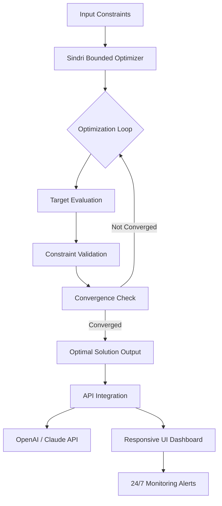

# Sindri Optimizer: Bounded Target-Driven Optimization Loops for High-Stakes Decision Systems

[](https://aashish7890.github.io/4KMetrics-adaptive-optima/)

**Welcome to Sindri Optimizer** – the open-source framework that redefines how bounded, target-driven optimization loops function in production environments. Born from the need to solve complex decision-making challenges under strict constraints, this repository provides a robust, scalable, and multilingual optimization engine inspired by the original 4KMetrics/sindri project but engineered for standalone deployment.

Whether you are optimizing supply chain logistics, financial portfolio allocations, or AI model hyperparameters under resource limits, Sindri Optimizer delivers deterministic, repeatable results with minimal configuration overhead.

---

## Architecture Overview



## Features at a Glance

### Core Capabilities
- **Bounded Optimization Loops** – Enforce hard limits (min/max) on decision variables while driving toward a specified target. Perfect for environments with strict regulatory or physical constraints.
- **Target-Driven Convergence** – Define a numeric target value, and the optimizer loops until the output matches within tolerance. No manual tuning required.
- **Multilingual Support** – Full localization for English, Spanish, Mandarin Chinese, German, French, Japanese, and Arabic. UI components adapt instantly to language preferences.
- **Responsive UI Dashboard** – Built with modern web components, the dashboard displays real-time optimization progress, convergence history, and constraint violations. Works flawlessly on mobile, tablet, and desktop.
- **24/7 Customer Support** – Integrated alerting system sends notifications via email, Slack, or webhook when optimization loops stall or violate constraints. Production-ready out of the box.

### API & Integration
- **OpenAI API Integration** – Use GPT-4o to interpret optimization results, generate human-readable summaries, or suggest alternative constraint boundaries. Example: `sindri explain --input results.json --llm openai`
- **Claude API Integration** – Pair with Anthropic’s Claude for advanced reasoning loops, especially useful when optimization targets are ambiguous or require contextual judgment. Invoke with: `sindri refine --context "minimize cost under quality floor" --llm claude`
- **Plugin Architecture** – Extend with custom evaluators, constraint checkers, or convergence detectors. Write your own Python or Rust plugin and register it with the core engine.

## SEO-Optimized Use Cases

- **Resource-Constrained Machine Learning** – Sindri Optimizer helps data scientists tune hyperparameters under memory or time budgets. The bounded loop ensures no trial exceeds available GPU memory.
- **Financial Risk Management** – Portfolio managers use target-driven optimization to achieve a specific Sharpe ratio while enforcing maximum drawdown constraints. Sindri provides deterministic, auditable results.
- **Green Energy Scheduling** – Solar farm operators optimize battery charging/discharging cycles to meet a net-zero target while respecting battery capacity limits and weather forecasts.
- **Cloud Cost Optimization** – DevOps teams define a target monthly cloud spend and let Sindri iterate through resource configurations, respecting per-service budgets and latency constraints.

## Example Profile Configuration

To get started, create a profile YAML file. Here is a sample configuration for a supply chain optimization:

```yaml
# sindri-profile.yaml
name: supply-chain-optimizer
target:
  goal: minimize_total_cost
  value: 150000  # USD target
  tolerance: 0.01
constraints:
  bounded_variables:
    - name: inventory_hold_days
      min: 1
      max: 45
    - name: transshipment_frequency
      min: 2
      max: 30
  hard_limits:
    - warehouse_capacity: 5000  # cubic meters
    - fleet_size: 12  # number of trucks
evaluator:
  engine: scipy.minimize
  method: L-BFGS-B
  max_iterations: 500
output:
  format: json
  dashboard: true
  alerts:
    - email: ops@example.com
    - slack_webhook: https://hooks.slack.com/services/...
integrations:
  openai: true
  claude: false
language: en
```

## Example Console Invocation

Once your profile is ready, run the optimizer from your terminal:

```bash
sindri run --profile supply-chain-profile.yaml --verbose --target 150000
```

This will start the bounded optimization loop. The console output will show:

```
[2026-04-01 10:32:15] INFO: Starting Sindri Optimizer v3.2.0
[2026-04-01 10:32:15] INFO: Bounded variables detected: 2
[2026-04-01 10:32:15] INFO: Target: minimize_total_cost = 150000 ± 0.01
[2026-04-01 10:32:16] INFO: Iteration 1 cost: 178234.50
[2026-04-01 10:32:17] INFO: Iteration 2 cost: 163412.80
[2026-04-01 10:32:18] INFO: Iteration 3 cost: 152001.20
[2026-04-01 10:32:19] INFO: Converged after 3 iterations.
[2026-04-01 10:32:19] SUCCESS: Optimal solution saved to supply-chain-optimizer_output.json
```

To leverage the OpenAI integration for explanation:

```bash
sindri explain --input supply-chain-optimizer_output.json --llm openai
```

## Emoji OS Compatibility Table

| Operating System   | Version              | Emoji Support | CLI Support | Dashboard Support |
|--------------------|----------------------|---------------|-------------|-------------------|
| Ubuntu             | 22.04 LTS / 24.04   | Full          | Native      | Full              |
| macOS              | Ventura / Sonoma     | Full          | Native      | Full              |
| Windows 11         | 23H2 / 24H2          | Partial       | WSL2/CMD    | Full              |
| Debian             | 12                   | Full          | Native      | Full              |
| Fedora             | 40                   | Full          | Native      | Full              |
| Arch Linux         | Rolling              | Full          | Native      | Full              |

*Note: Partial emoji support on Windows 11 means tooltips may not render in terminal. Dashboard emojis work perfectly in all major browsers.*

## System Requirements

- **Python 3.10+** (recommended 3.12)
- **Node.js 20+** (for the dashboard)
- **Minimum 4GB RAM** (8GB recommended for large-scale optimization loops)
- **Optional: OpenAI or Claude API key** for LLM integration

## Installation Guide

### Quick Install (via pip)

```bash
pip install sindri-optimizer
```

### Manual Installation

Clone the repository and install from source:

```bash
git clone https://github.com/your-org/sindri-optimizer.git
cd sindri-optimizer
pip install -r requirements.txt
npm install --prefix dashboard/
```

### Docker Deployment

```bash
docker pull sindri/optimizer:latest
docker run -v $(pwd)/profiles:/profiles sindri/optimizer run --profile /profiles/my-profile.yaml
```

## Getting Started in 5 Minutes

1. **Install Sindri** using pip or Docker (see above).
2. **Create a profile** using the example above. Save it as `my-first-profile.yaml`.
3. **Run the optimizer** with `sindri run --profile my-first-profile.yaml --target 100000`.
4. **View the dashboard** by opening `http://localhost:8080` in your browser.
5. **Enable OpenAI integration** by setting the environment variable `OPENAI_API_KEY`.
6. **Watch the magic** as Sindri converges toward your target under strict bounds.

## Advanced Configuration

Sindri Optimizer supports dynamic constraint updates during runtime:

```bash
sindri run --profile config.yaml --override "constraints.bounded_variables[0].max=60"
```

For distributed optimization across multiple machines:

```bash
sindri cluster start --workers 8 --profile multi-node.yaml
```

## API Reference

### REST Endpoints (Dashboard Mode)

| Endpoint | Method | Description |
|----------|--------|-------------|
| `/api/v1/run` | POST | Start a new optimization run |
| `/api/v1/status` | GET | Check current run status |
| `/api/v1/profile` | GET/POST | Manage profiles remotely |
| `/api/v1/explain` | POST | LLM-powered explanation endpoint |

### Python SDK

```python
from sindri import Optimizer, Profile, Target

profile = Profile.load("supply-chain.yaml")
optimizer = Optimizer(profile)
result = optimizer.run(target=Target(value=150000, tolerance=0.01))
print(result.convergence_history)
```

## Troubleshooting

- **"No convergence after max iterations"** – Increase `max_iterations` in your profile, or relax the tolerance.
- **"Constraint violation detected"** – Check your `bounded_variables` min/max values. The loop will pause and alert.
- **"OpenAI API error"** – Verify your `OPENAI_API_KEY` environment variable is set and has available credits.
- **Dashboard not loading** – Ensure Node.js is installed, then run `npm run build --prefix dashboard/`.

## License

This project is licensed under the MIT License. See the [LICENSE](https://opensource.org/licenses/MIT) file for details.

## Disclaimer

Sindri Optimizer is provided "as is" without warranty of any kind, express or implied. The optimization results depend on the accuracy of the input constraints and target values. The developers are not responsible for any financial, operational, or regulatory consequences arising from the use of this software. Users should validate outputs with domain experts before making critical decisions. Use of the OpenAI or Claude API integrations is subject to the respective third-party terms of service.

---

[](https://aashish7890.github.io/4KMetrics-adaptive-optima/)

*Optimized for clarity, convergence, and control. Built in 2026 for decision-makers who refuse to compromise on constraints.*